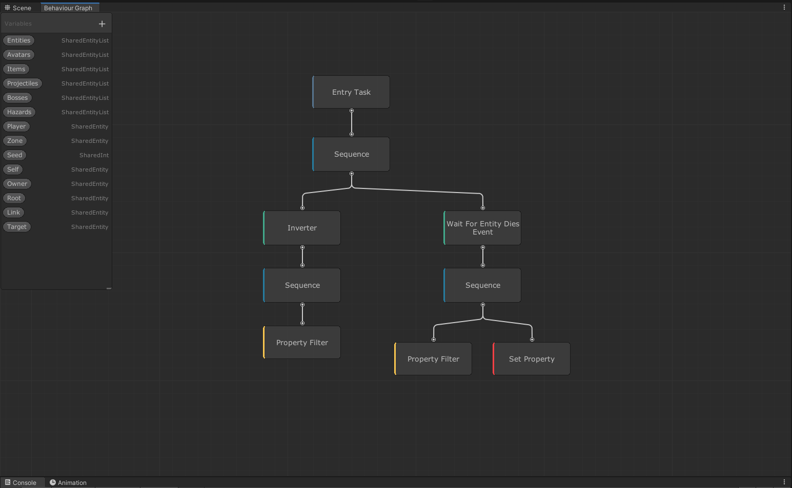
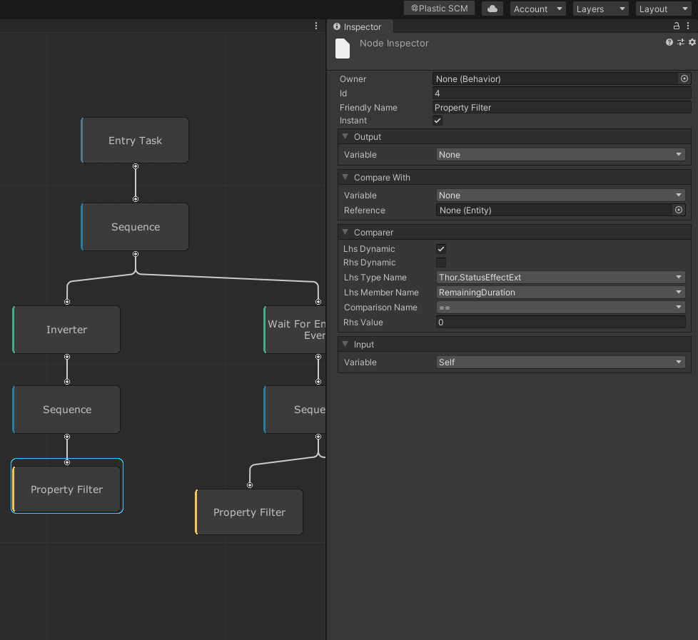
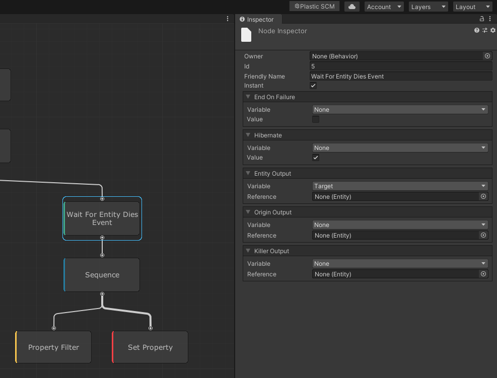
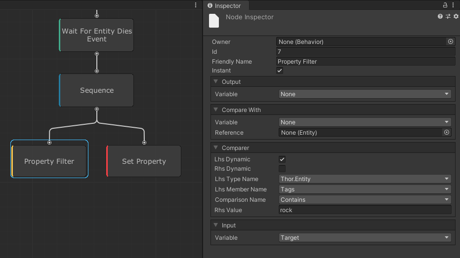
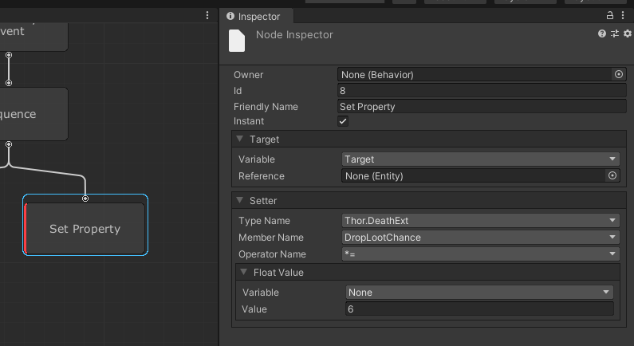

Allmost every behavior in UnderMine is controlled using what's called a behavior graph.

A tree is made up of a set of actions and conditions that allow you to define your behavior visually.

## Example
Let's look at an example of a very simple relic. 
The [Petrified Rock](https://undermine.fandom.com/wiki/Petrified_Rock). This relic increases the chance of items dropping from destroyed rocks by 6x. 
Here is the whole behavior tree.

export const Square = ({color}) => (
  

  

);

:::info
All nodes have a color depending on their type:

#### <Square color="#42AA8C"></Square> Decorator
A decorator is a node that can have only a single child.
It is up to the Decorator to decide if, when and how many times the child should be executed.

#### <Square color="#F9C64F"></Square> Condition
A condition is a node that decides if nodes following it should execute.
It returns `Success` or `Failure` depending on if the condition is fulfilled or not.

#### <Square color="#F93F44"></Square> Action
An action node has is any node that impacts the game world. Actions can't have children.

#### <Square color="#267CA0"></Square> Composite
A composite node groups multiple children into a branch.

:::

As the tree is always executed left to right, top to bottom we can see that the first group evaluated is this.

This group of three nodes is something almost all StatusEffect behaviors in UnderMine have.
It simply checks if the remaining duration is equal to 0 and inverts the result. 
Meaning the effect can only execute if there is some remaining duration left.

Lets look at the actual effect of the petrified rock.
First we wait for any entity to die. Storing the resulting entity in our `Target` Shared Variable. 
This allows us to access it in other nodes. 

Now we check if the entity that has died is actually a rock.  
Otherwise we would modify the drop-rate of all things.
We do this by checking if the entity has a tag of `rock`. 
Using the `Target` we stored earlier as the input.

Finally we simply multiply the drop chance of our `Target` by 6.
