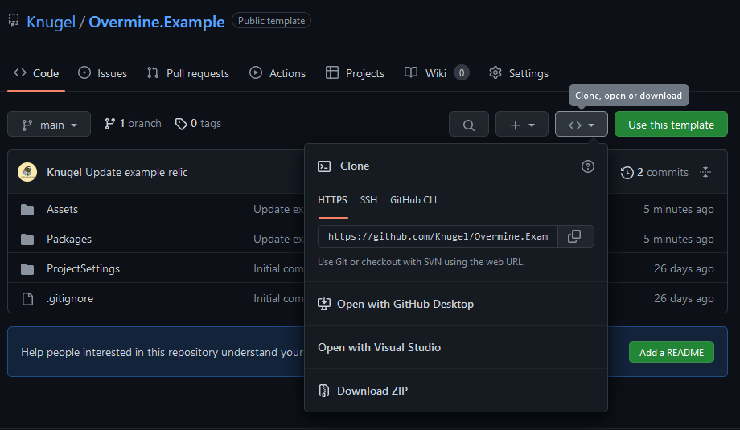
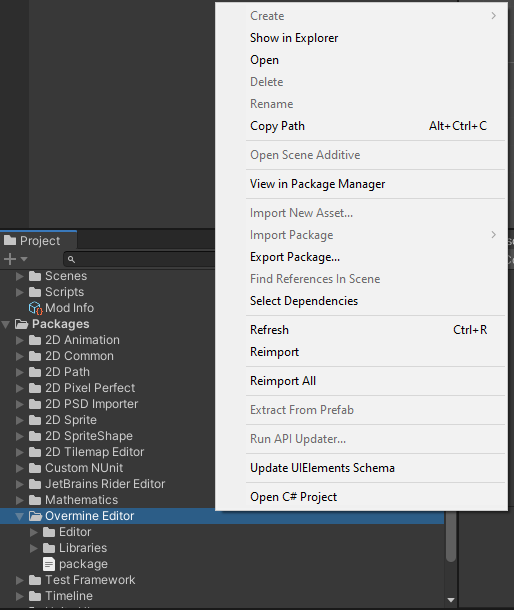
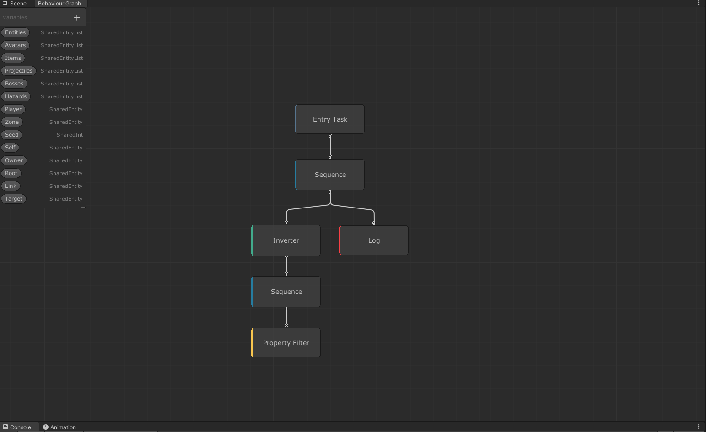

## Prerequisites
To start modding you will have to install a few prerequisites:
- [Unity 2019.4.x](https://unity3d.com/get-unity/download?thank-you=update&download_nid=65616&os=Win)
- [Git](https://git-scm.com/download/win)
- A Code Editor (e.g [VS Code](https://code.visualstudio.com/))

## Using the example mod
To make setup of a new mod easier there exists a simple example project.
### Download
Found under https://github.com/Knugel/Overmine.Example

To start download the project (either using git or downloading a zip file)

### Setup in Unity
Open the project folder in Unity and wait for the import process to finish (_The first time this can take quite a while_).

:::info
The first time you open the project you will see some errors in the console. **This is totally fine.**
:::

After the unity project is done loading and you can see the Editor close and reopen the project. 
Then `Reimport` the `Overmine Editor` package found in your Packages folder.

:::info
Now you should be able to open the example Relic effect (found under `Resources/Relic/Relic Effect`). 
And see something like this:

:::